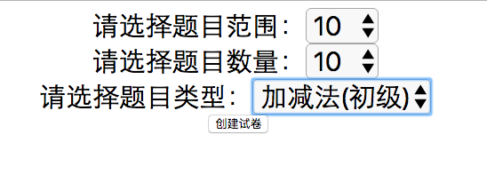
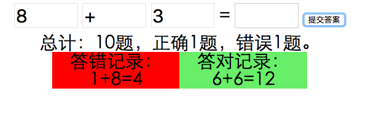
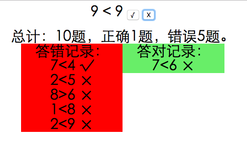
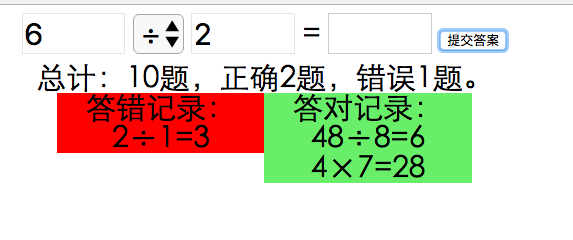

# math_for_primary_school #
math test for primary school
## 在线访问 ##
 地址：[在线试用](https://cdn.rawgit.com/jiy1012/math_for_primary_school/master/math.html "math.html")
# 小学加减乘除练习题 #
## 选择题目类型 ##

## 支持加减法 ##

## 支持比大小 ##

## 支持乘除法 ##

